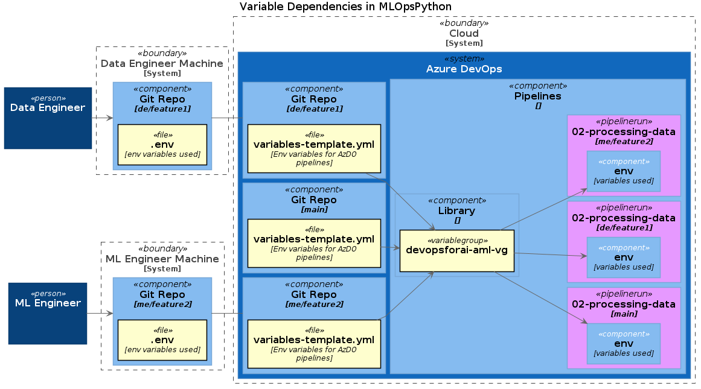

# Understanding Variable Dependencies

The current solution structure, which is inherited from [MLOpsPython](https://github.com/microsoft/MLOpsPython)
has three locations for defining and storing variables:

1. `.env` file on a developer host
2. `variables-template.yml` file used in AzDO Pipeline runs
3. Variable Group `devopsforai-aml-vg` which will override values defined in `variables-template.yml`

The below chart shows a system with 3 repo branches (main, de/feature1, me/feature2)
and two devs (a Data Engineer and a ML Engineer).
The chart is not self explaining. The explanation is continued below.

If the developers are executing python scripts leveraging the `Env() module`
the variables content is loaded from their local `.env` file and executed against
their Azure Machine Learning workspace which they configured there.

That also means they can independently change the values and do dev testing.

But when they come to the point where they need to test their AzDO Pipelines and
push their branch content to the git-remote and
run the pipeline on their feature branch the `variables-template.yml` of the branch
needs to be updated with all additional variables and values.

The part which needs most attention is the fact, that how the current AzDO pipelines are written,
regardless of the branch on which they are executed, the variable values used will be a combination
of content from `variables-template.yml` + content from the Variable Group `devopsforai-aml-vg`.
Especially the values from the Variable Group have priority over the values from  `variables-template.yml`.
Or you could say the values from `devopsforai-aml-vg` are overwriting the values of `variables-template.yml`.

E.g. pipelinerun on *me/feature2* branch will use the variable values from `variables-template.yml` in *me/feature2*
branch unless they are overridden by the values from Variable Group `devopsforai-aml-vg`.

> Important: The values in `variables-template.yml` can be different for every git branch, but the priority values from `devopsforai-aml-vg`
will be always the same for all pipeline runs regardless of the branch they run from!
